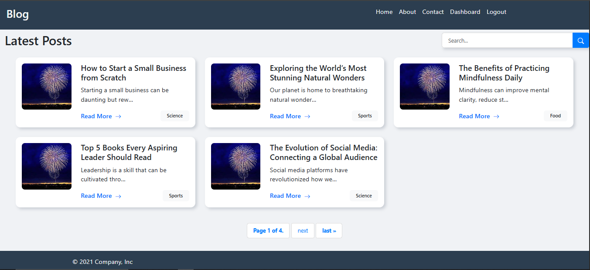

# 📄 Blog Management System — Django Project

## 📚 Project Overview
The **Blog Management System** is a web application built using **Django** that allows users to create, read, update, and delete blog posts.  
It includes user authentication (login/logout), an admin dashboard, and a clean, responsive frontend for managing blogs.

This project is ideal for learning **CRUD operations**, **Django models**, **user sessions**, and **dynamic HTML rendering** with templates.

## 🌟 Key Features
- User Authentication (Login/Logout)
- Create, Read, Update, Delete (CRUD) Blog Posts
- Django Admin Panel for full control
- Responsive Frontend UI
- Post Management Dashboard
- Clean URL Routing
- Validation and Error Handling

---

## 🛠️ Tools & Technologies Used
- **Backend**: Django (Python Framework)
- **Frontend**: HTML5, CSS3, Bootstrap (for styling)
- **Database**: SQLite3 (default) / (Used Database : MySQL)
- **Development Tools**: 
  - VS Code 
  - Git & GitHub
- **Other**: Django Admin Panel

---

## 🚀 How to Setup and Run Locally

Follow these steps to run the project on your local machine:

1. **Clone the repository**  
```bash
git clone https://github.com/karthi311/blog-management-system.git
cd blog-management-system--Django_project-
```

2. **Create a Virtual Environment**  
```bash
python -m venv venv
source venv/bin/activate  # For Linux/Mac
venv\Scripts\activate     # For Windows
```

3. **Install Required Packages**  
```bash
pip install -r requirements.txt
```

4. **Apply Migrations**  
```bash
python manage.py makemigrations
python manage.py migrate
```

5. **Create Superuser (for Admin Panel Access)**  
```bash
python manage.py createsuperuser
```
(Then enter username, email, and password.)

6. **Run the Development Server**  
```bash
python manage.py runserver
```

7. **Visit the Application**
- Open your browser and go to: `http://127.0.0.1:8000/`

---

---

## 📷 Screenshots

### 🏠 Home Page


---

<!-- ### 📝 Blog Post Creation


---

### 📜 Blog Post List


---

### 🔑 Login Page


---

### 🎛️ Admin Dashboard
 -->

---

## ✍️ Author
**S. Karthikeyan**  
- GitHub: [https://github.com/karthi311](https://github.com/karthi311)
- LinkedIn: [https://www.linkedin.com/in/karthikeyan311](https://www.linkedin.com/in/karthikeyan311)

---

## 📃 License
This project is licensed under the MIT License - see the [LICENSE](LICENSE) file for details.

---